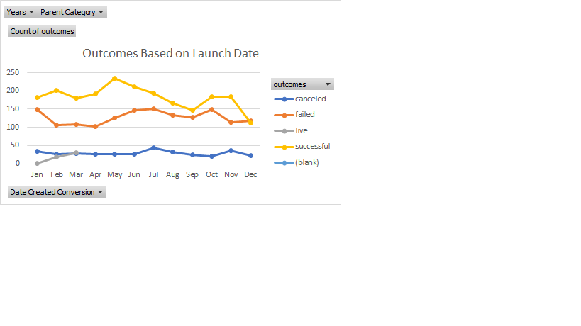
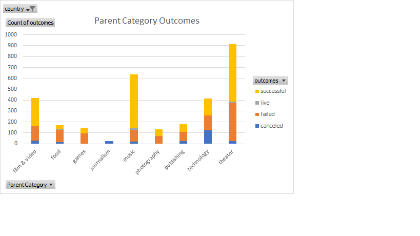

# excel-challenge
Using Excel, I helped a hopeful playwright prepare how to create goals for a kickstarter campaign that can be used to fund her prospective production. By looking at data from over 4000 completed kickstarters with their outcomes (successful, live, failed, canceled) documented, as well as goals in terms of how much money they'd like to collect, how many campaign-backers they had, and information on the sort of campaigns that were being launched, I was able to inform our playwright of what kind of goals she should set in order to find success in fully funding her play.
## Outcomes Based on Launch Date
Here's a look at the success various kickstarters achieved based on the beginning of when they began their campaigns.

## Parent Category Outcomes
And here is a look at the success various kickstarters achieved based on the parent category for which the campaign fell into.

