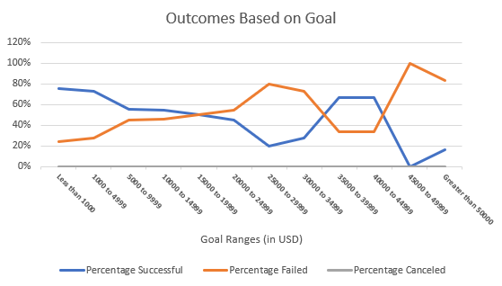

# excel-challenge
## Project Overview 
Using Excel, I helped a hopeful playwright prepare how to create goals for a kickstarter campaign that can be used to fund her prospective production. By looking at data from over 4000 completed kickstarters with their outcomes (successful, live, failed, canceled) documented, as well as goals in terms of how much money they'd like to collect, how many campaign-backers they had, and information on the sort of campaigns that were being launched, I was able to inform our playwright of what kind of goals she should set in order to find success in fully funding her play.
## Analysis and Challenges
### Outcomes Based on Launch Date
Here's a look at the success various kickstarters achieved based on the beginning of when they began their campaigns. We created a PivotTable with filters on Years and Parent Categories. The columns of this table were the outcomes; we were keeping a tally of all the outcomes (successful, failed, canceled, and live) - The Count of Outcomes was used in the "values" section of the PivotTable. The rows were the kickstarter Launch Dates (which themselves were coverted into mm/dd/yyyy from Unix time. The code utilized for this process can be found in the "Date Created Conversion" column on worksheet "Kickstarter" of the Kickstarter_Challenge.xlsx spreadsheet). Using Row Labels, we sorted the dates into the twelves months of the year. By this, we created the graph (seen below) to visualize how many kickstarters were launched in each month, and we measured how many were successful, failed, canceled, or still live. I experienced an initial challenge in sorting the dates into months, but after a little while, I figured out how to sort the dates into months!

### Parent Category Outcomes
Here is a look at the success various kickstarters achieved based on the parent category for which the campaign fell into. Using PivotTables, we set the filters to Country. The columns of the table were set to Outcomes, which we want to measure. Thus, the value box was populated with the Count of Outcomes. Finally, the rows were the Parent Categories, so we could evaluate the total number of outcomes for each Parent Category, to get a feel for what Parent Categories our data was partitioned into, and how many kickstarters were a part of each Parent Category. From here, we could sort out each Parent Cateogy using Row Labels, to look at the individual breakdown of outcomes for various Parent Categories. Using this, we could create a PivotChart (displayed below) to visualize the outcomes across all Parent Categories. A challenge here was simply conceptualizing what this graphic was displaying the first time I saw it. 

### Outcomes vs Goals
This is a visual depiction of the ratio of various outcomes for kickstarters based on the "Goals" that each kickstarter set before launching their respective campaigns.  Various "play" kickstarters set goals to bring in a certain amount of money by the end of their campaigns. The horizontal axis is constituted of various ranges of these "Goal" amounts. The vertical axis displays what proportion that successful, failed, and canceled kickstarters comprised relative to one another, based on the range of where their goals fell, set when they launched. This was produced by using =COUNTIF() functions in Excel. We created a table, in which we had the first column listed as the Goals for fundraising, partitioned into various ranges [(0, 999),(1000,4999), (5000,9999), ... , (45000,50000),(50000,inf)]. Then, we formulated three subsequent columns, with outcomes "Successful", "Failed", and "Canceled". Using the aforementioned =COUNTIF() function, we called on the 'Kickstarter' worksheet to count the number of successful outcomes for kickstarters that called for less than $1000 in their goal-making for their campaign. Then, we counted how many failed outcomes occurred in the same range of goals for fundraising, and so on with canceled. Then, we counted how many successful, failed, and canceled outcomes occurred if the kickstarter called for anywhere between $1000 and $4999. The code utilized for this process can be found in the "Number Successful", "Number Failed", and "Number Canceled" columns on the 'Outcomes Based on Goals' worksheet.

We did this throughout all the ranges of goals mentioned above. Finally, we then summed up the amount of kickstarters that called for goals in each range, and used simple division to visualize the proportion of each range that became successful, failed, or canceled. Using these proportions, we created the graph we see below. I experienced difficulty here in formatting this graph to fit all the axes and information I wanted it to, while also keeping it small enough to fit onto this GitHub page!

## Results
### Theatre Outcomes by Launch Date
The Theatre Outcomes by Launch Date analysis provides me some insight, which I can contextualize. The data shows that the majority of the kickstarters for plays launch around May through July. Though it is true that the brunt of successful kickstarters throughout the year launched in this time frame, it is also the case that the majority of failed kickstarters also launched during this window in time. From this, we can't necessarily conclude that kickstarters for plays launched in May through July will likely be successful; we can merely observe that most kickstarters are simply launched in this time frame. 

Now, we can observe something else interesting. We can see that kickstarters that launch between March through May are oftentimes more successful than they find themselves failing. By this, I mean that the rate that campaigns that become successful outpace the rate that campaigns that find themselves failing between March and May. More kickstarters launched in this time window become successful in meeting their fundraising goals than the amount which fail to meet their fundraising goals. So, I would suggest to Louise to launch her kickstarter in this time window, between the start of March and the start of May. Here, it appears kickstarters are most likely to find success based on launching at this time, specifically between April and May.

### Outcomes Based on Goals
Looking at our analysis on Outcomes Based on Goals, it is apparent to me that, generally, those kickstarters who set smaller goals tend to find greater success in fundraising what they aimed for. This is intuitive. In setting smaller goals for fundraising, one is more likely to  obtain that goal rather than striving for higher-set fundraising goals, which demand greater contributions.

### Limitations to Data Set
I can think of a few limitations to this data set. The first limitation that comes to my mind is the fact that these kickstarter campaign data only span a handful of years. The years it span are from 2014 through 2016. This is a very small window in time. Furthermore, it's not terribly up-to-date as it could be. Ideally, we could look at data from the past ten years (or so) through the present. Data from the years 2010 through 2020 would be especially helpful. Having the most-recent data would help us, as we could see how data trends through the present; into "real time". Though, all things considered, maybe data from 2020 would actually not be so helpful given how COVID-19 cut-short plans for plays or other highly social events. Nonetheless, I believe more up-to-date data, and a larger swath of data, would behoove our data set and its practicality in the present.

Additionally, I posit that more specific data would help us in setting the optimal parameters for a kickstarter for a play. More specific data in terms of location, for example, would assist in analyzing data. Knowing that a kickstarter is from a country is good. Knowing that a kickstarter is from a specific city in a specific state/province/county is more helpful, as we could then consider additional information as well. If we had insight into the annual income for a specific city where the kickstarter is based, then measure the average contribution to the kickstarter from that area, we could weight how valuable contributions are across various locations when evaluating the outcomes of that kickstarter campaign.

### Other Possible Charts/Graphs
Using our data, we could have provided a graph of outcomes of kickstarters based on when campaigns ended. We could have produced a graph measuring average donation versus time. We could produce descriptive statistics charts based on parent categories as a whole and compared all the parent categories to one another, looking at how the means, quartiles, and interquartile ranges spanned out.